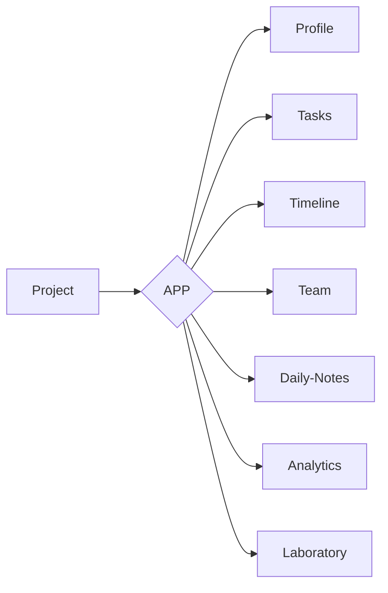

# Sobre o Projeto:
Repositorio criado para criar novos de design animado utilizando parallax


### TEMPLATES

```
1º - Chuva de Estrelas
2º - Lua e Nuvens
3º - Montanhas e Lua
```


### FLUXOGRAMA/DIAGRAMA



### FONTE:

https://blog.betrybe.com/html/iframe-html/

### 1.0 - FASES DO PROJETO

<ul>
  
  <li>
    <p><b><code>1.1 - [VIRTUAL ENV] </code></b></p>
    <p><i> Instrução:  </i></p>
  </li>
  
  <li>
    <p><b><code>1.2 - [FRONT-END] </code></b></p>
    <p><i> Fase-1: https://www.youtube.com/watch?v=wCOInE7-E0I  </i></p>
  </li> 
  
  <li>
    <p><b><code>1.3 - [BACK-END] </code></b></p>
    <p><i>  </i></p>
  </li>
  
</ul>

